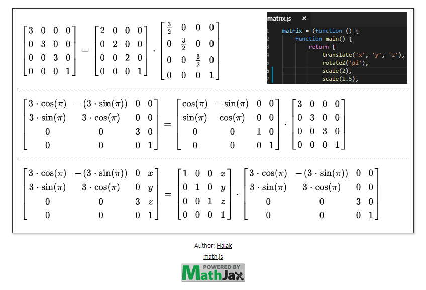

행렬 곱셈식 추적기
==============================
복잡한 행렬식을 만든 후 테스트해보면 행렬에는 연산된 값이 들어가기 때문에 입력 값이 올바르게 계산 되었는지 확인하기 어려웠습니다.
이 프로그램은 입력 값이 최종 행렬에 어떤 식으로 적용되는지 확인하기 위하여 만들어졌습니다.
행렬식을 최적화 하거나 디버깅할 때 쓸 수 있습니다.

사용법
----------
1. 텍스트 에디터에서 `matrix.js` 파일을 엽니다.
2. `main` 함수에서 반환하는 식을 작성합니다.
  - `x, y, sin(pi)`와 같은 변수를 넣어야 추적하기 편합니다.
  - `list`의 요소들이 모두 곱해집니다.
  - 행렬의 곱셈은 맨 뒤에서 역순으로 진행됩니다.
3. 웹 브라우저에서 `index.html` 파일을 엽니다.
4. 행렬식의 곱셈이 이루어지는 과정을 확인할 수 있습니다.
